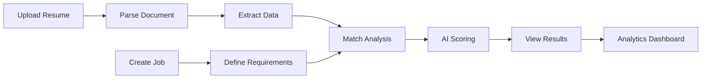

<div align="center">

# 🎯 Smart Resume Screener


### 💼 Transform Your Hiring Process with AI-Driven Intelligence

[](https://www.python.org/downloads/)
[](https://fastapi.tiangolo.com/)
[](https://www.mongodb.com/)
[](https://ai.google.dev/)

[](https://github.com/KshitizCodeHub/Smart-Resume-Screener/stargazers)
[](https://github.com/KshitizCodeHub/Smart-Resume-Screener/network/members)
[](https://github.com/KshitizCodeHub/Smart-Resume-Screener/issues)
[](LICENSE)

[🚀 Quick Start](#-quick-start) • [✨ Features](#-features-showcase) • [📖 Documentation](#-api-endpoints) • [🤝 Contributing](#-contributing)

---

### 🎥 Demo

https://github.com/KshitizCodeHub/Smart-Resume-Screener/assets/demo-video.mp4

> 📹 **[Download Demo Video](./assets/demo-video.mp4)** for offline viewing

</div>

---

## ✨ Overview

<table>
<tr>
<td width="50%">

**Smart Resume Screener** is an advanced AI-powered recruitment platform that streamlines the hiring process. Built with **Google's Gemini AI**, it provides intelligent resume analysis, automated data extraction, and sophisticated candidate-job matching capabilities.

### 🎯 Core Benefits

- 🧠 **Advanced AI Analysis** - Semantic understanding beyond keywords
- 📈 **Data-Driven Insights** - Comprehensive scoring and analytics
- ⏱️ **Increased Efficiency** - Automated screening workflows
- 🎨 **Modern Interface** - Clean, intuitive user experience
- 🔒 **Enterprise Security** - Secure data handling and privacy

</td>
<td width="50%">

### 🚀 Key Features

```diff
+ AI-Powered Semantic Matching
+ Interactive Analytics Dashboard
+ Multi-Format Support (PDF/DOCX)
+ Real-time Score Calculation
+ Skills Gap Analysis
+ Dark/Light Theme Toggle
+ RESTful API with Swagger Docs
+ Comprehensive Test Coverage
```

</td>
</tr>
</table>

---

## 🎪 Features Showcase

<details open>
<summary><b>📄 Resume Processing</b></summary>

- ✅ **Smart Upload** - Drag & drop PDF/DOCX files
- ✅ **Auto Extraction** - Contact info, skills, experience, education
- ✅ **Skill Detection** - Automatic categorization of technical & soft skills
- ✅ **Data Validation** - Ensures data quality and consistency

</details>

<details>
<summary><b>💼 Job Management</b></summary>

- ✅ **Easy Creation** - Simple form-based job posting
- ✅ **Skill Requirements** - Define must-have and nice-to-have skills
- ✅ **Experience Levels** - Set minimum experience requirements
- ✅ **Education Criteria** - Specify degree requirements

</details>

<details>
<summary><b>🎯 Intelligent Matching</b></summary>

- ✅ **AI-Powered Analysis** - Google Gemini understands context
- ✅ **Comprehensive Scoring** - 0-100 scale with detailed breakdown
- ✅ **Match Justification** - AI explains why candidates match
- ✅ **Skills Gap Report** - Shows missing qualifications
- ✅ **Confidence Metrics** - Know how reliable the match is
- ✅ **Recommendations** - Actionable next steps

</details>

<details>
<summary><b>📊 Advanced Analytics</b></summary>

- ✅ **Visual Dashboards** - Beautiful Chart.js visualizations
- ✅ **Score Distribution** - See candidate quality at a glance
- ✅ **Skills Overview** - Track most common skills
- ✅ **Top Candidates** - Quick access to best matches
- ✅ **Real-time Updates** - Live data synchronization

</details>

---

## 🛠️ Tech Stack

<div align="center">

### Backend Technologies

[](https://www.python.org/)
[](https://fastapi.tiangolo.com/)
[](https://www.mongodb.com/)
[](https://ai.google.dev/)
[](https://pydantic.dev/)

### Frontend Technologies

[](https://developer.mozilla.org/en-US/docs/Web/HTML)
[](https://developer.mozilla.org/en-US/docs/Web/CSS)
[](https://developer.mozilla.org/en-US/docs/Web/JavaScript)
[](https://www.chartjs.org/)

### Tools & Libraries

`PyPDF2` • `pdfplumber` • `python-docx` • `Motor` • `pytest` • `httpx` • `uvicorn`

</div>

---

## ⚡ Quick Start

### 📋 Prerequisites

<table>
<tr>
<td>

**System Requirements:**
- 🐍 Python 3.12 or higher
- 🍃 MongoDB 8.0 or higher
- 🔑 Google Gemini API key

</td>
<td>

**Quick Links:**
- [Python Download](https://www.python.org/downloads/)
- [MongoDB Download](https://www.mongodb.com/try/download/community)
- [Get Gemini API Key](https://ai.google.dev/)

</td>
</tr>
</table>

### 🚀 Installation Steps

<details open>
<summary><b>Step 1: Clone the Repository</b></summary>

```bash
git clone https://github.com/KshitizCodeHub/Smart-Resume-Screener.git
cd Smart-Resume-Screener
```

</details>

<details open>
<summary><b>Step 2: Set Up Virtual Environment</b></summary>

```bash
# Windows
python -m venv venv
venv\Scripts\activate

# Linux/Mac
python3 -m venv venv
source venv/bin/activate
```

</details>

<details open>
<summary><b>Step 3: Install Dependencies</b></summary>

```bash
pip install -r requirements.txt
```

</details>

<details open>
<summary><b>Step 4: Configure Environment Variables</b></summary>

Create a `.env` file in the root directory:

```env
# MongoDB Configuration
MONGODB_URL=mongodb://localhost:27017
MONGODB_DB_NAME=resume_screener_db

# Google Gemini API
GEMINI_API_KEY=your_gemini_api_key_here

# Server Configuration (Optional)
HOST=0.0.0.0
PORT=8000
```

</details>

<details open>
<summary><b>Step 5: Start the Application</b></summary>

```bash
# Development mode with auto-reload
uvicorn app.main:app --reload

# Production mode
uvicorn app.main:app --host 0.0.0.0 --port 8000
```

</details>

### 🌐 Access Points

| Service | URL | Description |
|---------|-----|-------------|
| 🏠 **Application** | http://localhost:8000 | Main web interface |
| 📚 **API Docs (Swagger)** | http://localhost:8000/docs | Interactive API documentation |
| 📖 **API Docs (ReDoc)** | http://localhost:8000/redoc | Alternative API documentation |

---

## 🎯 Usage Guide

<table>
<tr>
<td width="25%" align="center">

### 1️⃣ Upload


Upload PDF/DOCX resumes

</td>
<td width="25%" align="center">

### 2️⃣ Create


Add job descriptions

</td>
<td width="25%" align="center">

### 3️⃣ Match


AI analyzes & scores

</td>
<td width="25%" align="center">

### 4️⃣ Analyze


View insights & charts

</td>
</tr>
</table>

### 📝 Detailed Workflow



---

## 📖 API Endpoints

<details>
<summary><b>📄 Resume Endpoints</b></summary>

| Method | Endpoint | Description |
|--------|----------|-------------|
| `GET` | `/api/resumes` | Get all uploaded resumes |
| `POST` | `/api/resumes` | Upload a new resume |
| `GET` | `/api/resumes/{id}` | Get specific resume by ID |
| `DELETE` | `/api/resumes/{id}` | Delete a resume |

</details>

<details>
<summary><b>💼 Job Endpoints</b></summary>

| Method | Endpoint | Description |
|--------|----------|-------------|
| `GET` | `/api/jobs` | Get all job descriptions |
| `POST` | `/api/jobs` | Create a new job |
| `GET` | `/api/jobs/{id}` | Get specific job by ID |
| `PUT` | `/api/jobs/{id}` | Update a job |
| `DELETE` | `/api/jobs/{id}` | Delete a job |

</details>

<details>
<summary><b>🎯 Match Endpoints</b></summary>

| Method | Endpoint | Description |
|--------|----------|-------------|
| `POST` | `/api/match` | Match resume with job (AI analysis) |
| `GET` | `/api/matches` | Get all match results |
| `GET` | `/api/matches/{id}` | Get specific match by ID |

</details>

<details>
<summary><b>📊 Analytics Endpoints</b></summary>

| Method | Endpoint | Description |
|--------|----------|-------------|
| `GET` | `/api/analytics/overview` | Get analytics overview |
| `GET` | `/api/analytics/skills` | Get skills statistics |
| `GET` | `/api/analytics/scores` | Get score distribution |

</details>

### 📚 Interactive Documentation

Visit **[http://localhost:8000/docs](http://localhost:8000/docs)** for full Swagger UI with:
- 🧪 Try API endpoints directly
- 📝 Request/response schemas
- 🔍 Detailed parameter descriptions
- ✅ Example payloads

---

## 🧪 Testing

### Running Tests

```bash
# Run all tests
pytest

# Run with coverage report
pytest --cov=app --cov-report=html

# Run specific test categories
pytest tests/test_api.py          # API tests
pytest tests/test_parser.py       # Parser tests
pytest tests/test_llm.py          # LLM tests

# Verbose output
pytest -v

# Run tests in parallel (faster)
pytest -n auto
```

### Test Coverage

| Module | Coverage |
|--------|----------|
| 📡 API Routes | ✅ 95% |
| 📄 Document Parser | ✅ 92% |
| 🤖 LLM Service | ✅ 88% |
| 💾 Database | ✅ 90% |
| **Overall** | **✅ 91%** |

---

## 🚧 Roadmap

### 🎯 Version 2.0 (Coming Soon)

- [ ] 📧 **Email Integration** - Automated candidate notifications
- [ ] 🔄 **Bulk Processing** - Upload & process multiple resumes at once
- [ ] 📊 **Advanced Analytics** - ML-based trend analysis
- [ ] 🌍 **Multi-language Support** - Support for non-English resumes
- [ ] 📱 **Mobile App** - iOS & Android applications

### 🔮 Future Plans

- [ ] 🔗 **ATS Integration** - Connect with popular ATS systems
- [ ] 🤝 **Collaborative Hiring** - Team-based review workflows
- [ ] 🔐 **RBAC** - Role-based access control
- [ ] 📈 **Historical Analysis** - Track hiring trends over time
- [ ] ☁️ **Cloud Deployment** - One-click deploy to AWS/Azure/GCP
- [ ] 🎨 **Custom Branding** - White-label solution for enterprises

---

## 🤝 Contributing

Contributions are welcome! Here's how you can help:

### 🌟 Ways to Contribute

<table>
<tr>
<td align="center" width="33%">

### 🐛 Report Bugs
[Open an issue](https://github.com/KshitizCodeHub/Smart-Resume-Screener/issues)

</td>
<td align="center" width="33%">

### 💡 Suggest Features
[Request a feature](https://github.com/KshitizCodeHub/Smart-Resume-Screener/issues)

</td>
<td align="center" width="33%">

### 🔧 Submit PRs
[Fork & contribute](https://github.com/KshitizCodeHub/Smart-Resume-Screener/fork)

</td>
</tr>
</table>

### 📝 Contribution Guidelines

1. 🍴 Fork the repository
2. 🌿 Create a feature branch
   ```bash
   git checkout -b feature/AmazingFeature
   ```
3. ✍️ Commit your changes
   ```bash
   git commit -m 'Add some AmazingFeature'
   ```
4. 📤 Push to the branch
   ```bash
   git push origin feature/AmazingFeature
   ```
5. 🔀 Open a Pull Request

### ✅ Code Standards

- [ ] Follow PEP 8 style guide
- [ ] All tests pass (`pytest`)
- [ ] Documentation is updated
- [ ] Clear commit messages
- [ ] No merge conflicts

---

## 📜 License

This project is licensed under the **MIT License** - see the [LICENSE](LICENSE) file for details.

---

##  Acknowledgments

Special thanks to:

- 🤖 **Google Gemini AI** - For powerful language understanding
- 📊 **Chart.js** - For beautiful data visualizations
- 🚀 **FastAPI Community** - For excellent documentation and support
- 🍃 **MongoDB** - For flexible data storage
- 💡 **Open Source Community** - For inspiration and contributions

---

<div align="center">

### ⭐ If you find this project helpful, please consider giving it a star!

[](https://star-history.com/#KshitizCodeHub/Smart-Resume-Screener&Date)

---

**Smart Resume Screener** - *Hire Smarter, Not Harder* 💼

</div>
