<div align="center">

# 🎯 Smart Resume Screener

**Intelligent AI-Powered Resume Screening & Candidate Matching System**

Transform your recruitment process with cutting-edge AI technology that understands resumes like a human expert.

[](https://www.python.org/downloads/)
[](https://fastapi.tiangolo.com/)
[](https://www.mongodb.com/)
[](https://ai.google.dev/)
[](https://www.langchain.com/)

[](LICENSE)
[](CONTRIBUTING.md)
[](https://github.com/KshitizCodeHub/Smart-Resume-Screener/stargazers)

[🚀 Quick Start](#installation) • [✨ Features](#-key-features) • [📚 API Docs](#-api-endpoints) • [🎨 Screenshots](#-demo)

</div>

---

## 🎬 Demo

<div align="center">

https://github.com/user-attachments/assets/ea0b34bb-5886-45c3-a440-4c1994d4e296

**🎥 Watch the complete workflow:** Resume Upload → AI Analysis → Intelligent Matching → Visual Analytics

*Experience the power of AI-driven recruitment in action*

</div>

---

## ✨ Key Features

<table>
<tr>
<td width="50%">

### 🤖 **AI-Powered Analysis**
- Smart resume parsing (PDF, DOCX, TXT)
- Google Gemini 2.5 Flash integration
- Semantic job matching with scoring
- Automated data extraction

</td>
<td width="50%">

### 🎨 **Modern Interface**
- Dark/Light theme with persistence
- Interactive Chart.js analytics
- Drag & drop file upload
- Real-time processing updates

</td>
</tr>
</table>

### 🏗️ **Technical Highlights**

- **Async FastAPI** with Motor for MongoDB operations
- **LangChain 0.2.16** for LLM orchestration  
- **Pydantic validation** ensuring data integrity
- **Enhanced prompts** with few-shot learning
- **Auto-retry logic** for reliable AI responses

---

## 🛠️ Tech Stack

<div align="center">


</div>

| Component | Technology | Purpose |
|-----------|-----------|---------|
| **Framework** | FastAPI 0.115.5 | Async web server |
| **Database** | Motor 3.3.2 | MongoDB async driver |
| **LLM Chain** | LangChain 0.2.16 | AI orchestration |
| **AI Model** | Gemini 2.5 Flash | NLP processing |
| **Parser** | pypdf 6.1.1, pdfplumber | Document extraction |
| **Frontend** | Vanilla JS, Chart.js | UI & analytics |

---

## 📋 Prerequisites

- Python 3.12+
- MongoDB (local or Atlas)
- Google Gemini API key ([Get free key](https://ai.google.dev/))

---

## 🚀 Installation

```bash
# Clone repository
git clone https://github.com/KshitizCodeHub/Smart-Resume-Screener.git
cd Smart-Resume-Screener

# Install dependencies
pip install -r requirements.txt

# Configure environment
cp .env.example .env
# Add your GEMINI_API_KEY to .env

# Run application
uvicorn app.main:app --reload
```

**Access:** http://localhost:8000 | **API Docs:** http://localhost:8000/docs

<details>
<summary><b>� Environment Configuration</b></summary>

```env
MONGODB_URL=mongodb://localhost:27017
MONGODB_DB_NAME=resume_screener
GEMINI_API_KEY=your_api_key_here
ALLOWED_ORIGINS=http://localhost:8000
MAX_FILE_SIZE_MB=10
```

</details>

---

## 📖 Usage

### Workflow

```mermaid
graph TD
    A[📤 Upload Resume] -->|PDF/DOCX/TXT| B[🤖 AI Extraction]
    B --> C[💾 MongoDB Storage]
    D[📝 Create Job] --> E[🎯 Define Requirements]
    C --> F{🔍 Match}
    E --> F
    F --> G[🧠 Gemini Analysis]
    G --> H[📊 View Results]
```



1. **Upload Resume** - Drag & drop PDF/DOCX/TXT files
2. **Create Job** - Define job description and requirements
3. **Run Match** - AI analyzes compatibility (0-10 score)
4. **Review Results** - See scores, justifications, and analytics

---

## 🔌 API Endpoints

| Method | Endpoint | Description |
|--------|----------|-------------|
| `GET` | `/health` | Health check |
| `POST` | `/api/upload-resume` | Upload resume file |
| `GET` | `/api/resumes` | Get all resumes |
| `GET` | `/api/resumes/{id}` | Get single resume |
| `DELETE` | `/api/resumes/{id}` | Delete resume |
| `POST` | `/api/create-job` | Create job |
| `GET` | `/api/jobs` | Get all jobs |
| `POST` | `/api/match` | Match resume with job |
| `POST` | `/api/match-all` | Match all resumes |

**Interactive Docs:** http://localhost:8000/docs

<details>
<summary><b>� API Usage Examples</b></summary>

**Upload Resume:**
```bash
curl -X POST "http://localhost:8000/api/upload-resume" \
  -F "file=@resume.pdf"
```

**Match Resume:**
```bash
curl -X POST "http://localhost:8000/api/match" \
  -H "Content-Type: application/json" \
  -d '{"resume_id": "...", "job_id": "..."}'
```

</details>

---

## 🏗️ Project Structure

```
Smart-Resume-Screener/
├── app/
│   ├── main.py                     # FastAPI entry point
│   ├── config.py                   # Configuration
│   ├── api/
│   │   ├── routes.py               # API endpoints
│   │   └── schemas.py              # Pydantic models
│   ├── database/
│   │   └── mongodb.py              # MongoDB operations
│   ├── services/
│   │   ├── llm_service_enhanced.py # Enhanced AI service
│   │   ├── matcher.py              # Matching logic
│   │   └── pdf_parser.py           # Document parsing
│   └── models/                     # Data models
├── frontend/
│   ├── index.html                  # Main UI
│   ├── css/styles.css              # Styling
│   └── js/app.js                   # Frontend logic
├── tests/                          # Test suite
├── requirements.txt                # Dependencies
└── .env                            # Configuration
```

---

## 🧪 Testing

## 🧪 Testing

## 🧪 Testing

```bash
pytest                    # Run all tests
pytest -v                 # Verbose output
pytest --cov=app         # With coverage
```

---

## 🤝 Contributing

Contributions welcome! Please:
